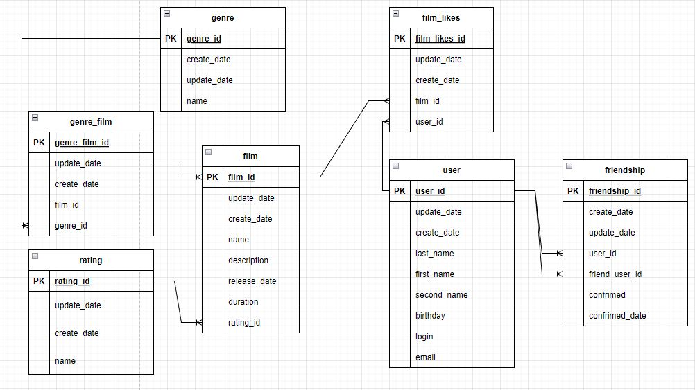

# java-filmorate



Сложность возникла только с таблицей ДРУЗЕЙ, а именно добавление пользователя в друзья. и пришел к выводу, что:

1. пользователь 1 присылает предложение в друзья пользователю 2. создается запись типа

| user_id | friend_user_id | confirmed |
|---------|----------------|-----------|
| 1       | 2              | 0         |

2. когда пользователь 2 принимает дружбу создаем аналогичную запись, но наоборот и меняем поле confirmed на 0

| user_id | friend_user_id | confirmed |
|---------|----------------|-----------|
| 1       | 2              | 1         |
| 2       | 1              | 1         |

хоть размер таблицы увеличиться в двое, тем самым мы уменьшаем скорость работы SELECT. сравним:

``` sql
SELECT *
  FROM USER u
 WHERE u.user_id = IN (SELECT f.friend_user_id
                         FROM friendship f
                        WHERE f.user_id = 1
                       UNION
                       SELECT f.user_id
                         FROM friendship f
                        WHERE f.friend_user_id = 1);
``` 

против

``` sql
SELECT u.*
  FROM USER u
 INNER JOIN friendship f ON u.user_id = f.user_id
 WHERE u.user_id = 1;
``` 

============== SELECT запросы ==============

1) Get friends of user 1

``` sql
SELECT *
  FROM USER u
 INNER JOIN friendship f ON u.user_id = f.user_id
 WHERE u.user_id = 1
 AND f.confrimed_id = 2; -- только друзья подтвердивщие заявку
```

2) Get common friends of users 1 and 2

``` sql
SELECT *
  FROM USER u
 WHERE u.id IN (SELECT f.friend_user_id
                  FROM friendship f
                 WHERE (f.user_id = 1
                       OR f.user_id = 2)
                       AND f.confrimed_id = 2 -- только друзья подтвердивщие заявку
                 GROUP BY f.friend_user_id
                HAVING COUNT(*) > 1);
```

3) Get all users

``` sql
SELECT * FROM user;
```

4) Get user with id 1

``` sql
SELECT * FROM user WHERE user_id = 1;
```

5) Get film with id 1

``` sql
SELECT * FROM film WHERE film_id = 1;
```

6) Find most popular films (show all films whether or not liked, ordered by amount of likes)

``` sql
SELECT f.*
  FROM film f
  LEFT JOIN film_likes fl
    ON f.id = fl.film_id
 GROUP BY f.id
         ,f.name
 ORDER BY COUNT(*) DESC
LIMIT
    CASE
      WHEN p_limit IS NOT NULL
         THEN p_limit
      ELSE 10 END;
```